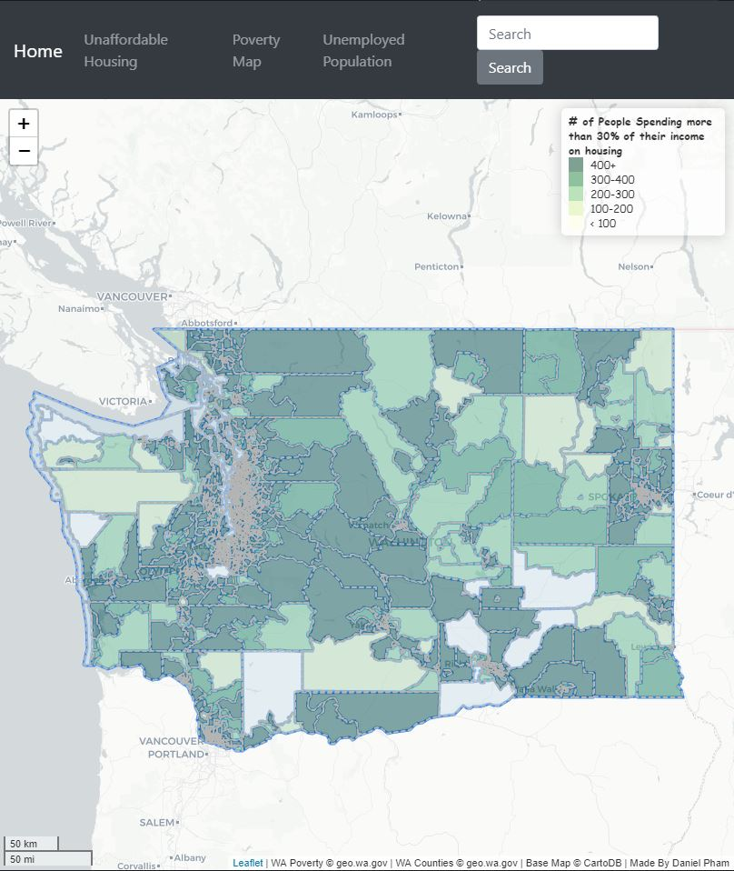
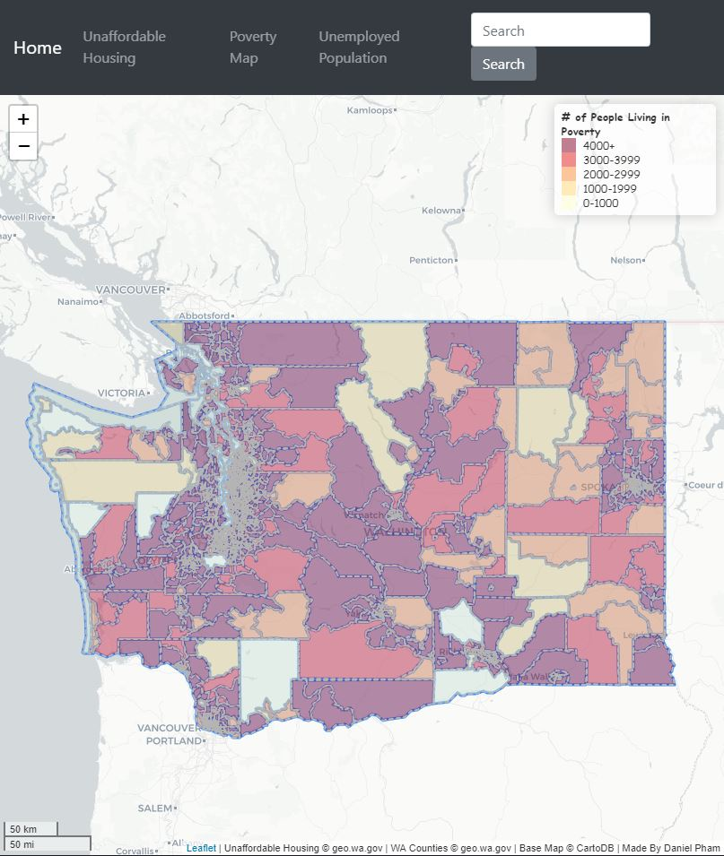
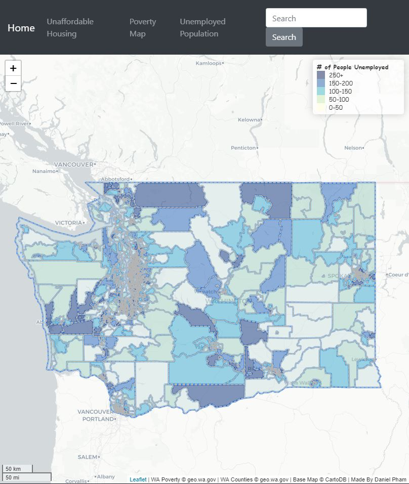

# Unaffordable Living in WA State

  The goal of this project is to examine the trend, which are people are struggling the most while living in WA State. It is to show that even though WA State can be rank #1 in the country, it's still one of the most expensive state to live in especially around Seattle area. Data Sources that are mostly used within this project is obtained from [Washing State Geospatial Open Portal](https://geo.wa.gov/). Basemap is from CartoDB providing a light color background to help minimize distraction and only focus on data being used wtihin the webmap. You can see that a lot of high data values are focused around Seattle area. While exploring the webmap of the projects. You can find many dark shaded area when zoomed in around Seattle area and its counties. These areas tend to contain a lot of people living in poverty, and those who don't have enough to spare and live their life checks by checks.

  Some snippets of following maps are below:

  
  
  
